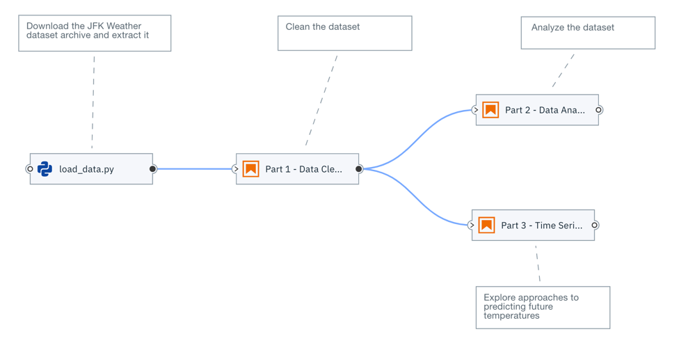
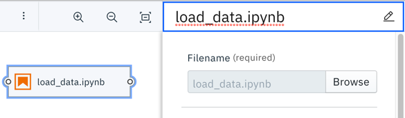
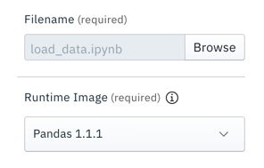
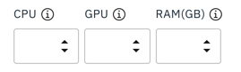
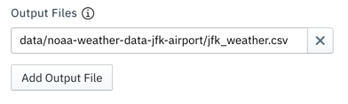
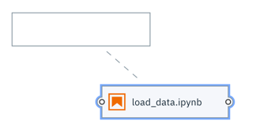
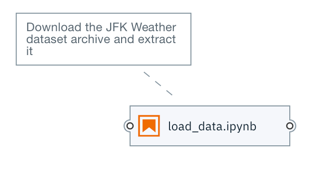
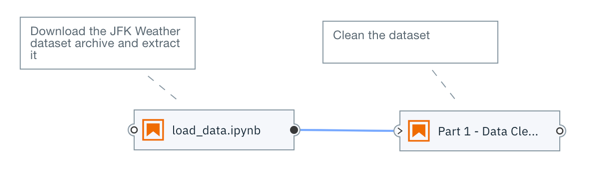
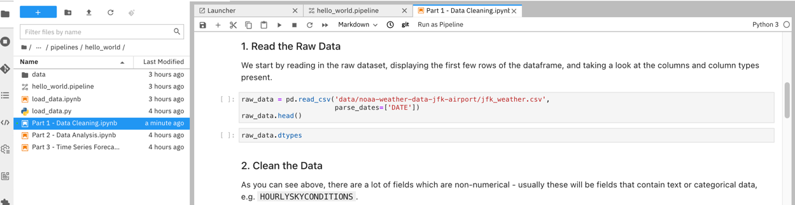

<!--

Copyright 2018-2020 Elyra Authors

Licensed under the Apache License, Version 2.0 (the "License");
you may not use this file except in compliance with the License.
You may obtain a copy of the License at

http://www.apache.org/licenses/LICENSE-2.0

Unless required by applicable law or agreed to in writing, software
distributed under the License is distributed on an "AS IS" BASIS,
WITHOUT WARRANTIES OR CONDITIONS OF ANY KIND, either express or implied.
See the License for the specific language governing permissions and
limitations under the License.

-->
## Automate notebook workflows using open source tools

[JupyterLab](https://jupyter.org/) is a popular open source development environment among data scientists and machine learning engineers that use Jupyter notebooks extensively. JupypterLab can be customized and enhanced using [extensions](https://jupyterlab.readthedocs.io/en/stable/user/extensions.html).

[Elyra](https://elyra.readthedocs.io/en/latest/getting_started/overview.html) is a set of AI centric extensions to JupyterLab that provide productivity features for common day to day activities. One of its key features is the support for pipelines, which allows for batch execution of notebooks or Python/R scripts:



In the example above, each notebook/script in the pipeline  implements a typical data science task, such as data loading, data cleasing, data analysis, or model training. Pipelines provide a way to automate the execution of these tasks.

The Visual Pipeline Editor in Elyra allows for the assembly of pipelines without the need for any coding and supports execution of those pipelines locally in JupyterLab, or remotely on [Kubeflow Pipelines](https://www.kubeflow.org/docs/components/pipelines/overview/pipelines-overview/) or [Apache Airflow](http://airflow.apache.org/).


In this tutorial you will learn how to create a basic pipeline and run it in a local JupyterLab environment. When you run a pipeline in your local environment, each notebook or script is executed in a Kernel on the machine where JupyterLab is running, such as your laptop. Since resources on that machine might be limited local pipeline execution might not always be a viable option.

 If you are interested in learning more about how to run pipelines in remote environments such as Kubeflow Pipelines or Apache Airflow, refer to the [Hello World Kubeflow Pipelines tutorial](https://github.com/elyra-ai/examples/tree/master/pipelines/hello_world_kubeflow_pipelines) and the [Hello World Apache Airflow tutorial](https://github.com/elyra-ai/examples/tree/master/pipelines/hello_world_apache_airflow). (Note that those tutorials require a Kubeflow Pipelines/Apache Airflow deployment, which is not provided.)

### Prerequisites

You can complete this tutorial using a [ready-to-use Elyra container image](https://elyra.readthedocs.io/en/latest/getting_started/installation.html#docker) in your local environment (e.g. running Docker Desktop) or using a public sandbox environment that's hosted in the cloud.

### Launching the tutorial

#### Running the tutorial on your local machine

To complete this tutorial in your local environment an installation of [Docker Desktop](https://www.docker.com/products/docker-desktop) is required. 

To run the tutorial:

1. Open a terminal window.
1. Create a directory named `lab-material` in `${HOME}`. When you run the container image this directory is used to store files that you create in the JupyterLab development environment. (You can choose a different name and location but need to update the `docker run` command below accordingly.)
1. Create a directory named `jupyter-data-dir` in `${HOME}`. When you run the container image this directory is used to store metadata files that Elyra creates in the JupyterLab development environment. (You can choose a different name and location but need to update the `docker run` command below accordingly.)
1. Run the Elyra container image.

   ```
   $ docker run -it -p 8888:8888\
    -v ${HOME}/lab-material/:/home/jovyan/work\
    -w /home/jovyan/work\
    -v ${HOME}/jupyter-data-dir:/home/jovyan/.local/share/jupyter\
    elyra/elyra:2.2.4 jupyter lab
   ```
 1. Open the displayed URL (e.g. `http://127.0.0.1:8888/lab?token=...`) in your web browser.

You are ready to start the tutorial. Note that you can shut down and restart the container because the information required to complete the lab is persisted in the two directories you've created earlier.

#### Running the tutorial in a sandbox on the cloud

To complete this tutorial in a public sandbox environment on the cloud open [this link](https://mybinder.org/v2/gh/elyra-ai/elyra/v2.2.4?urlpath=lab/tree/binder-demo) in your web browser. In the cloud sandbox environment the container image is built for you on the fly and should be ready after a couple of minutes. Do note that the sandbox environment does not persist any changes you are making. If you disconnect (or are disconnected due to a bad connection), all changes are discarded and you need to start over. 

You are ready to start the tutorial.

### Clone the pipeline artifacts

This tutorial is based on a set of Jupyter notebooks and Python scripts that are published in the https://github.com/CODAIT/ddc-data-and-ai-2021-automate-using-open-source GitHub repository.
The Elyra installation includes a git extension, which provides access to common source control tasks within your JupyterLab environment.

To clone the tutorial artifacts:

1. In the JupyterLab GUI open the _Git clone_ wizard (`Git` > `Clone a Repository`).

   
1. Enter `https://github.com/CODAIT/ddc-data-and-ai-2021-automate-using-open-source.git` as _Clone URI_.
1. In the _File Browser_ navigate to `ddc-data-and-ai-2021-automate-using-open-source/jupyterlab-and-elyra/pipelines/hello_world`.

   
   
   The cloned repository includes a set of notebooks that download an open [weather data set from the Data Asset Exchange](https://developer.ibm.com/exchanges/data/all/jfk-weather-data/), cleanse the data, analyze the data, and perform time-series predictions.

### Create a pipeline

1. Open the _Launcher_ (`File` > `New Launcher`) if it is not already open.

   

1. Open the _Pipeline Editor_ (`Elyra` > `Pipeline Editor`) to create a new untitled pipeline.

   

1. In the _File Browser_ pane, right click on the untitled pipeline, and select &#x270E; _Rename_.

   

1. Change the pipeline name to `hello_world`.

Next, you'll add a notebook or script to the pipeline that downloads an open data set archive from public cloud storage.

### Add a notebook or script to the pipeline

1. From the _File Browser_ pane drag the `load_data.ipynb` notebook onto the canvas. If you  like, you can add the `load_data.py` Python script instead. The script provides the same functionality as the notebook. The instructions below assume that you've added the notebook to the pipeline, but the steps you need to complete are identical.

   

1. Right click on the `load_data` node to customize its properties.

   

   Some properties are only required when you plan to run the pipeline in a remote environment, such as Kubeflow Pipelines. However, it is considered good practice to always specify those properties to allow for easy migration from development (where you might run a pipeline locally) to test and production (where you would want to take advantage of resources that are not available to you in a local environment). Details are in the instructions below.

1. By default the file name is used as node label. You should customize the label text if it is too long (and therefore displayed truncated on the canvas) or not descriptive enough.

   

1. As _Runtime Image_ choose `Pandas`. The runtime image identifies the container image that is used to execute the notebook or Python script when the pipeline is run on Kubeflows Pipelines or Apache Airflow. This setting must always be specified but is ignored when you run the pipeline locally. Click [here](https://elyra.readthedocs.io/en/stable/user_guide/runtime-image-conf.html) to learn more about runtime images and how to use your own images.

   

   If the container requires a specific minimum amount of resources during execution, you can specify them. 

   

   > If no custom requirements are defined, the defaults in the target runtime environment (Kubeflow Pipelines or Apache Airflow) are used.

   If a notebook or script requires access to local files, such as Python scripts, you can specify them as _File Dependencies_. When you run a pipeline locally this setting is ignored because the notebook or script can access all (readable) files in your workspace. However, it is considered good practice to explicitly declare file dependencies to make the pipeline also runnable in environments where notebooks or scripts are executed isolated from each other.

1. The `load_data` file does not have any input file dependencies. Leave the input field empty.

    

    If desired, you can customize additional inputs by defining environment variables. The `load_data` file requires environment variable `DATASET_URL`. This variable identifies the name and location of a data set, which the notebook or script will download and decompress. 
    
1. Assign environment variable `DATASET_URL` the value `https://dax-cdn.cdn.appdomain.cloud/dax-noaa-weather-data-jfk-airport/1.1.4/noaa-weather-data-jfk-airport.tar.gz`.

   ```
   DATASET_URL=https://dax-cdn.cdn.appdomain.cloud/dax-noaa-weather-data-jfk-airport/1.1.4/noaa-weather-data-jfk-airport.tar.gz
   ```

    

    If a notebook or script generates files that other notebooks or scripts in the pipeline require access to, specify them as _Output Files_. This setting is ignored if you are running a pipeline locally because all notebooks or scripts in a pipeline have access to the same shared file system. However, it is considered good practice to declare these files to make the pipeline also runnable in environments where notebooks or scripts are executed in isoluation from each other.

1.  Declare an output file named `data/noaa-weather-data-jfk-airport/jfk_weather.csv`, which other notebooks in this pipeline process.

    

    > It is considered good pratice to specify paths that are relative to the notebook or script location to keep the pipeline portable.

1. Select the `load_data` node and attach a comment to it.

   

   The comment is automatically associated with the node.

   

1. In the comment node enter a descriptive text, such as `Download the JFK Weather dataset archive and extract it`.

   

1. Save the pipeline.

    

Next, you'll add a data pre-processing notebook to the pipeline and connect it with the first notebook in such a way that it is executed _after_ the first notebook. This notebook cleans the data in  `data/noaa-weather-data-jfk-airport/jfk_weather.csv`, which the `load_data` notebook or script produced.

### Add a second notebook to the pipeline

1. Drag the `Part 1 - Data Cleaning.ipynb` notebook onto the canvas.
1. Customize its execution properties as follows:
   - Runtime image: `Pandas`
   - Output files: `data/noaa-weather-data-jfk-airport/jfk_weather_cleaned.csv`
1. Attach a comment node to the `Part 1 - Data Cleaning` node and provide a description, such as `Clean the dataset`. 
1. Connect the _output port_ of the `load_data` node to the _input port_ of the `Part 1 - Data Cleaning` node to establish a dependency between the two notebooks.

   

   When a pipeline is executed dependent nodes are processed in sequential order (node-1 -> node-2). Nodes that have no dependencies defined between them are processed in random order  when you run a pipeline locally in JupyterLab and processed in parallel when you run a pipeline on Kubeflow Pipelines or Apache Airflow.

1. Save the pipeline.

    

You are ready to run the pipeline in JupyterLab.

### Running a pipeline locally

When you run a pipeline locally the notebooks and Python/R scripts are executed on the machine where JupyterLab is running.

1. Run the pipeline.

   

1. Enter `hello_world_pipeline` as _Pipeline name_.

   

   Note that you can only choose a different runtime platform (Kubeflow Pipelines or Apache Airflow) after you've created a [runtime configuration](https://elyra.readthedocs.io/en/stable/user_guide/runtime-conf.html) for that platform. The last section in this tutorial includes links to resources that outline how to run pipelines on those platforms.

1. Start the pipeline run. A message similar to the following is displayed after the run completed.

    

You can monitor the run progress in the terminal window where you've launched JupyterLab. (Note that you don't have access to the output when you are completing this tutorial in the cloud-hosted sandbox environment.)


### Inspect the pipeline run results

A _local pipeline run_ produces the following output artifacts:
- Each executed notebook is updated and includes the run results in the output cells.
- Script output (e.g. logging messages sent to STDOUT/STDERR) is displayed in the terminal window where JupyterLab is running.
- If a notebook/script produces files they are stored in the local file system.

You can access output artifacts from the _File Browser_. In the screen capture below the `hello_world` pipeline output artifacts are highlighted in green.

 

1. Open the `Part 1 - Data Cleaning` notebook by double clicking on the file name in the File Browser. The output cells should contain the results that code cells produced.

   For illustrative purposes let's also use the git integration to review how one of the notebooks was changed while it was executed.

1. From the sidebar select the `Git` tab. Note the files listed in the `Changed` (modified files) section and the `Untracked` (new files) section. 

   

   Most of the new files were produced while the pipeline was processed. The only exception is the `hello_world.pipeline` file, which you've created when you assembled the pipeline.

1. Select one of the modified notebook files and right click on its name to review the available actions.

   

1. Select `Diff` to compare the updated notebook with the original version.

1. Expand the twistie next to one of the `Metadata changed` or `Outputs changed` sections to review the differences.

   

1. Close the file comparison tab. 

   For illustrative purposes, let's revert the changes for one of the modified files.

1. Select one of the modified notebook files, right click, and choose `Discard`. Note that the file name disappeared from the `Changed` section in the Git panel.

1. Switch to the File Browser tab and open that notebook file. The output cells should now be empty.

   

   While you have the notebook editor open, let's also briefly review some of the editor productivity enhancements Elyra includes.

1. Click in one of the code cells and right click. The first three listed actions are something you are probably very familiar with from other development environments. Try them out!

   

   The fourth action, `Show diagnostics panel`, provides access to linting output, which helps you keep the code clean and tidy (:

   

   The same actions are available by default in Elyra's Python editor and optionally for the [R script editor](https://elyra.readthedocs.io/en/stable/user_guide/enhanced-script-support.html).

This concludes the tutorial.

### Summary, next steps, and resources

This concludes the introductory Elyra tutorial. You've learned how to 
- create a pipeline
- add and configure notebooks or Python scripts
- run a pipeline in a local environment
- monitor the pipeline run progress
- inspect the pipeline run results
- use the git feature to compare file versions and revert changes
- simplify common code development tasks

#### Next steps

If you'd like you can extend the pipeline by adding two more notebooks, which can be executed in parallel after notebook `Part 1 - Data Cleaning.ipynb` was processed:
 - `Part 2 - Data Analysis.ipynb`
 - `Part 3 - Time Series Forecasting.ipynb`

Each of the notebooks can run in the `Pandas` container image and doesn't have any input dependencies, doesn't require any environment variables and doesn't produce an additional output files.

 

#### Resources

If you have questions about Elyra or suggestion, please connect with us using one of the channels listed in [the community documentation](https://elyra.readthedocs.io/en/stable/getting_started/getting-help.html).

The following resources provide more information about pipelines:
   - [Create and run pipelines on Kubeflow Pipelines](https://github.com/elyra-ai/examples/tree/master/pipelines/hello_world_kubeflow_pipelines)
   - [Create and run pipelines on World Apache Airflow](https://github.com/elyra-ai/examples/tree/master/pipelines/hello_world_apache_airflow)
   - [Example pipelines](https://elyra.readthedocs.io/en/stable/getting_started/tutorials.html#sample-pipelines)